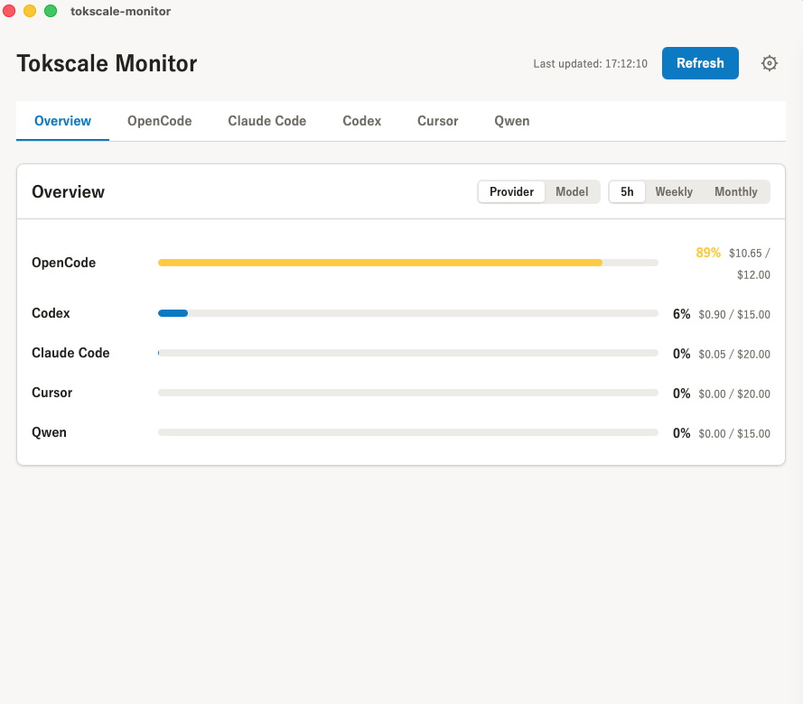

# Tokscale Monitor

> **⚠️ Early development / Work in progress**  
> This project is actively being built and is not yet feature-complete. Some parsers are stubs, and the UI/UX will evolve.

A desktop app (built with Tauri + SvelteKit) that monitors token usage and estimated costs across multiple AI coding assistants.



## Features

- **Multi-provider support** — Track usage across OpenCode, Claude Code, Codex, Cursor, Windsurf, and Qwen
- **Overview dashboard** — Provider totals or per-model breakdown with rolling windows (5h / Weekly / Monthly)
- **Settings panel** — Toggle which providers appear as tabs; settings persist via localStorage
- **System tray** — Runs in the tray; click to show/hide, right-click for menu

## Supported Providers

| Provider | Status | Notes |
|----------|--------|-------|
| OpenCode | ✅ Live | SQLite parser |
| Claude Code | ✅ Live | JSONL parser with token-based cost estimation |
| Codex | ✅ Live | JSONL parser with per-response cost tiers |
| Qwen | ✅ Live | JSONL parser with real token usage |
| Cursor | 🚧 Stub | Config ready; parser awaits data format confirmation |
| Windsurf | 🚧 Stub | Config ready; parser awaits data format confirmation |

## Tech Stack

- **Frontend:** Svelte 5, Tailwind CSS, SmartHR Design System
- **Backend:** Rust (Tauri), rusqlite
- **Build:** Vite

## Installation

Download the latest release or build from source.

### Build from source

```bash
# Install dependencies
npm install

# Build for production
npm run tauri build
```

Artifacts are generated in `src-tauri/target/release/bundle/`:
- **macOS App:** `macos/tokscale-monitor.app`
- **macOS DMG:** `dmg/tokscale-monitor_0.1.0_aarch64.dmg`

### Install the .app

```bash
# Copy to Applications
cp -R "src-tauri/target/release/bundle/macos/tokscale-monitor.app" /Applications/

# Launch
open /Applications/tokscale-monitor.app
```

### Auto-start on login (macOS)

```bash
# Add to login items
osascript -e 'tell application "System Events" to make login item at end with properties {path:"/Applications/tokscale-monitor.app", hidden:false}'
```

Or manually: **System Settings → Users & Groups → Login Items → +**

## Development

```bash
# Install dependencies
npm install

# Run in dev mode (starts Vite + Tauri)
npm run tauri dev
```

## License

MIT
